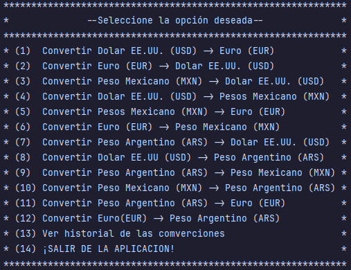
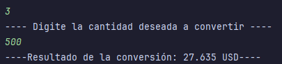
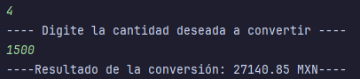
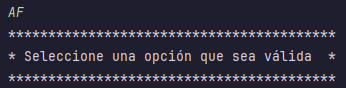
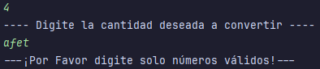
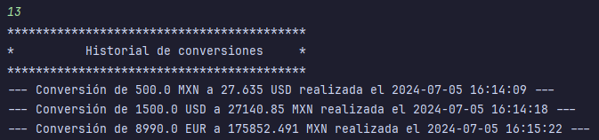

  	

# *_Conversor de Divisas_*

Este proyecto es la solucion al challenge **Conversor de divisas**, fue crea con base al material y cursos proporcionados por **_Oracle Next Education (ONE) Alura Latam_**.
El proyecto permitira al usuario realizar la conversion en varios tipod e divisas las cuales estan al cambio actual.

El proyecto utiliza la API **_ExchangeReate-API_** la cual permite realizar cambios a tiempo real asi mismo tiene una gran cantida de divisas para convertir.

Asu ves la aplicación cuenta con la utilizacion de la biblioteca **_Gson_** para poder manejar datos *_JSON_* que la misma aplicación utiliza.

## Funcionalidades

**_Menu_**: Muestra y realiza la funcion de scanner de las 14 opciones mostradas en pantalla

  	

**_Divisas Convertidas_**: Muesta el valor convertido a la divisa anterior mente selecionada.

  	

  	

**_Funciones invalidas_**: manda un mensaje de alerta cuando se ingresa alguna opcion invalidad y alguna cantidad invalidad

  	

  	

**_Resgitro de Deivisas convertidas_**: Muestra un historial de las divisas que se an convertido en el lapso de ejecion de la aplicación.

  	

## Tecnologias utilizadas

- **_Leguaje de Programacion_**: JAVA.
- **_API_**: [ExchangeRate-API](https://www.exchangerate-api.com/).
- **_Libreria_**: [Gson](https://github.com/google/gson).
